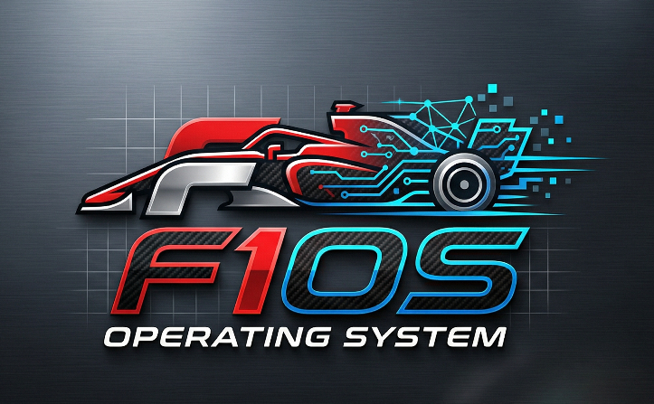

# 🏎️ F1OS (Formula 1 Operating System)

## 🏁 Descripció
**F1OS** és un sistema operatiu de 64 bits desenvolupat sobre el framework **Cosmos (C# Open Source Managed Operating System)**. 

Inspirat en l'enginyeria de precisió de la Fórmula 1, aquest sistema busca la màxima optimització, velocitat de resposta i una arquitectura modular que permeti un rendiment "pole position" en cada procés.

---

## 👥 Membres del Grup
El "Pit Wall" d'aquest projecte està format per:
* **Jefferson Méndez** 🏎️
* **Biel Duran** 🔧

---

## 🛠️ Estructura del Repositori
Per mantenir el garatge ordenat, utilitzem la següent estructura:
* `src/`: Codi font del Kernel i biblioteques del sistema.
* `docs/`: Documentació tècnica i manuals d'usuari.
* `assets/`: Recursos gràfics, logotips i icones.

---

## 🚀 Tecnologies utilitzades
* **Llenguatge:** C# (.NET Core)
* **Kernel Base:** Cosmos Kit
* **Arquitectura:** x86/x64

---

## 📄 Llicència
Aquest projecte està sota la llicència **MIT**. Pots consultar el fitxer `LICENSE` per a més detalls.
