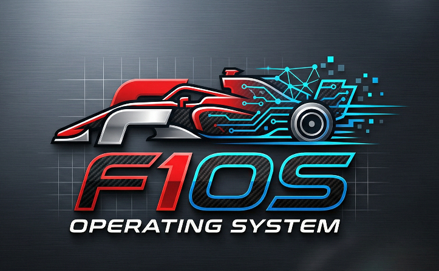

Aquí tens el **README.md** actualitzat amb les noves millores tècniques i d'organització, mantenint la coherència amb la temàtica de Fórmula 1:

---

# 🏎️ F1OS (Formula 1 Operating System)

## 🏁 Descripció
**F1OS** és un sistema operatiu de 64 bits desenvolupat sobre el framework **Cosmos (C# Open Source Managed Operating System)**. 

Inspirat en l'enginyeria de precisió de la Fórmula 1, aquest sistema busca la màxima optimització, velocitat de resposta i una arquitectura modular que permeti un rendiment "pole position" en cada procés.

---

## 👥 Membres del Grup
El "Pit Wall" d'aquest projecte està format per:
* **Jefferson Méndez** 🏎️
* **Biel Duran** 🔧

---

## 🛠️ Estructura del Repositori
Per mantenir el garatge ordenat i facilitar el manteniment, hem organitzat el projecte de la següent manera:
* `src/`: Codi font del Kernel i biblioteques del sistema. Ara modularitzat en diferents fitxers per separar la lògica de comandaments, àudio i sistema de fitxers.
* `docs/`: Documentació tècnica i manuals d'usuari.
* `assets/`: Recursos gràfics, logotips i icones.

---

## 🚀 Tecnologies utilitzades
* **Llenguatge:** C# (.NET Core)
* **Kernel Base:** Cosmos Kit
* **Arquitectura:** x86/x64
* **Àudio:** Cosmos Audio Driver

---

## 🆕 Funcionalitats recents

### 💾 Memòria de Comandes (Race History)
S'ha implementat un sistema de telemetria bàsica per a les comandes:
* **Historial:** El sistema emmagatzema les **últimes 5 comandes** executades.
* **Recuperació:** L'usuari pot recuperar i tornar a executar comandes prèvies per guanyar temps a la "línia de boxs".

### 🧹 Manteniment de Pista (Clear Screen)
* S'ha afegit la comanda `cls` o `clear` per netejar la pantalla de la terminal, eliminant el "marcatge" de comandes anteriors i deixant la interfície neta per a noves operacions.

### 🔊 Sistema d'Àudio (Pit Wall Radio)
* **Startup Sound:** Melodia de benvinguda.
* **Feedback sonor:** Sons diferenciats per a comandes correctes i errors de sistema.

### ⚙️ Arquitectura i Codi (Engineering Dept.)
* **Refactorització:** El codi s'ha separat en funcions i fitxers independents segons la seva responsabilitat (gestió de fitxers, unitat aritmètica, drivers d'àudio).
* **Documentació interna:** S'han afegit comentaris tècnics detallats a tot el codi font per facilitar el treball col·laboratiu i futures expansions.

---

## 📂 Gestió de Fitxers i Directoris
* Suport per a la creació, llistat (`ls`), eliminació i navegació entre directoris dins de la unitat de disc.

## 🧮 Unitat Aritmètica (Engine Stats)
* Comanda `calc` amb suport per a: Suma, Resta, Multiplicació, Divisió, Mòdul (`mod`) i Arrel quadrada (`sqrt`).

---

## 📄 Llicència
Aquest projecte està sota la llicència **MIT**. Pots consultar el fitxer `LICENSE` per a més detalls.

---

### 💡 Propers passos
> Estem treballant en millorar la persistència de dades i en una interfície visual encara més immersiva per a l'experiència F1OS.